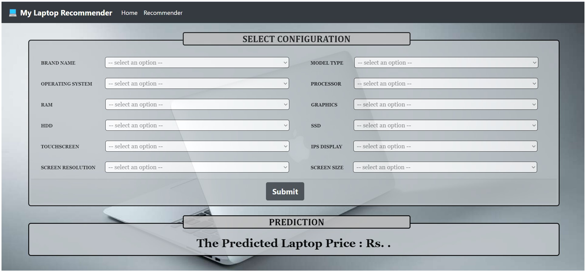

# Laptop-Price-Predictor
  Laptop has become one of the most essential and used items in our daily life. However, I am sure that you have struggled to choose the personal laptop that fits your needs? With the overwhelming amount of specifications and brand names on the market, it becomes difficult for laptop makers to sell their products and for customers to pick their laptop.
  We will make a project to predict the price of laptops based on user input. The problem we are addressing is that there are many different combinations of configurations that can be done, so if people want to buy a new laptop, then our app should have all the prices sorted by their configuration. Although it looks like a simple project or just developing a model, the dataset we have is noisy and needs lots of feature engineering, and pre-processing that will make your interest in developing this project higher.

# Project-Screen-shot

# Project Flow
1. Load the data
2. Analyze and visualize the dataset
3. Model training.
4. Model Evaluation.
5. Testing the model.
